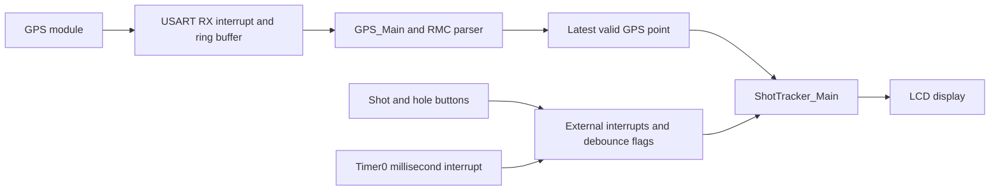

# Golf Shot Tracker

## Basic Requirements
 - Track golf shot distances
 - Differentiate between shots
 - Track score
 
## Optional Future Requirements
 - Save X last rounds of data
 - Integrate data with map overlay
 - Select club for each shot
 - Track FIR, GIR, and putts
 - Retrieve round data to PC
 - Choose 9 or 18 hole round
 - Undo shots
 - "Speed golf" mode where you also record time taken for the round

## Distance Calculation
### Assumptions
 - Earth circumference is 40075 km
 - All distances for shots will be up to a maximum of 500m
 - The short-distance nature of this applications means I can assume that the Earth is flat for the purpose of the calculation
 - The cosine factor for the longitude can be calculated once as the user won't be travelling far enough for it to change meaningfully

### Thinking behind calculation
In GPS coordinates, the 40075 km circumference of the earth is broken up into 360 degrees and each degree is broken up further into 60 "minutes" (or arcminutes) and each minute is broken up again into 60 "seconds." The format of the latitude and longitude data in the GPRMC NMEA message is as follows: (D)DDmm.mm where DD (or DDD for longitude) is the degrees north or south and mm.mm is the minutes and fractions of a minute after the decimal point.

Each degree represents 40075 km / 360 = ~111.32 km. Each minute represents 111.32 km / 60 = ~1.86 km. 

Looking at some example data received from the NEO-7M GPS module, we see the following:
$GPRMC,012943.00,A,3653.30550,S,17448.74535,E,0.973,,031026,,,A*65

So this data says the GPS is at 36 degrees, 53.30550 minutes south and 174 degrees, 48.74535 minutes east. If each minute represents ~1.86 km then the decimal values must represent the following:
 - tenths : 185.5 m
 - hundredths : 18.55 m
 - thousandths : 1.855 m
 - tens-of-thousandths 0.1855 m

The NEO-7M based module I am using claims to have to be accurate to within 2.5 m

Since this application doesn't actually care where you are and only cares about the distance between two points in distances up to 500m, I should be able to ignore all the data before the decimal point and just use the data after. e.g. instead of 3653.30550, I could just use 30550. In fact, since the final decimal point represents a distance of ~0.019 m, I should be able to ignore this as well and just use 3055 which means even the maximum possible value here (9999) will still fit into a 16 bit variable.

I can store points as a latitude and longitude value in this form as below:
```c
typedef struct
{
    uint16_t lat;
    uint16_t lon;
} Point_t;
```

I can then take the difference in latitude and longitude between two points and use that to calculate how far apart they are using the Pythagorean theorem based on the assumption that, due to the small distances I am measuring, the Earth can be modelled as flat. I will have to scale the difference in longitude value by the cosine of the latitude to account for the varying distance between lines of longitude as you move toward/away from the poles. I can do this by pre-computing a LUT of cosine values scaled to uint8 size (0 to 255).


e.g.
```c
Point_t point1 =
{
    .lat = 3550,
    .lon = 7453
};

Point_t point2 = 
{
    .lat = 3595,
    .lon = 7400
}

uint16_t latDiff = point2.lat - point1.lat; // For this example I am just subtracting larger from smaller since they are known but will handle this in the code.
uint16_t lonDiff = point1.lon - point2.lon; 

float dist = sqrt(latDiff^2 + (cos(lon) * lonDiff)^2) * 0.1855; // Pseudocode, 0.1855 m per lat/lon unit (units of tens-of-thousandths of an arcminute or arcminute / 10000)
```

## System Overview

The Golf Shot Tracker uses GPS positions to measure each shot and keeps a shot count for each of 18 holes. At startup, the display shows the first hole prompt. The shot button starts tracking from the current valid GPS point. As the golfer moves, the display shows the distance from that point to the latest GPS position. Pressing the shot button at the ball records the measured distance and starts tracking the next shot. Pressing the hole button records the current segment and advances to the next hole.

The GPS module must provide at least one valid fix before shot tracking can start. Until then, pressing the shot button displays a waiting-for-GPS message. The GPS module retains its most recent valid point when later sentences are invalid or are not RMC sentences. Each hole can store up to 10 shots; attempting another shot displays "Pick it up mate" until the next-hole button is pressed. After hole 18, the display shows the total score, calculated as the sum of the shot counts for all holes.

Shot data is currently stored in RAM and is cleared when the tracker is initialized. Saving rounds across power cycles is a future requirement.

## Architecture and Data Flow

| Module | Responsibility |
| --- | --- |
| `main.c` | Initializes the peripherals and repeatedly processes GPS input and tracker state. |
| `USART.c` | Receives GPS bytes in an interrupt and places them in a ring buffer. |
| `GPS.c` | Parses active GPRMC/GNRMC fixes, retains the latest valid point, and provides the longitude scale factor. |
| `Buttons.c` | Detects debounced shot and hole button presses using external interrupts. |
| `Timer.c` | Generates the millisecond tick used for button debounce timing. |
| `ShotTracker.c` | Manages hole and shot state, calculates distances, and totals the round score. |
| `LCD.c` | Writes status, distance, and score information to the 16x2 display. |



## Future Improvements
